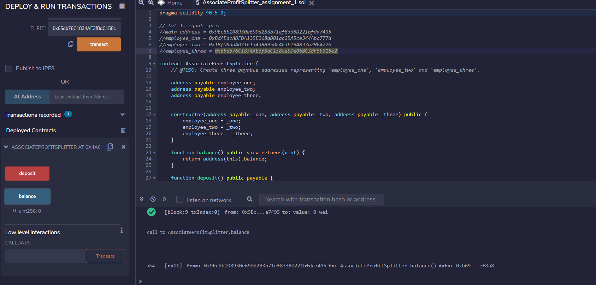
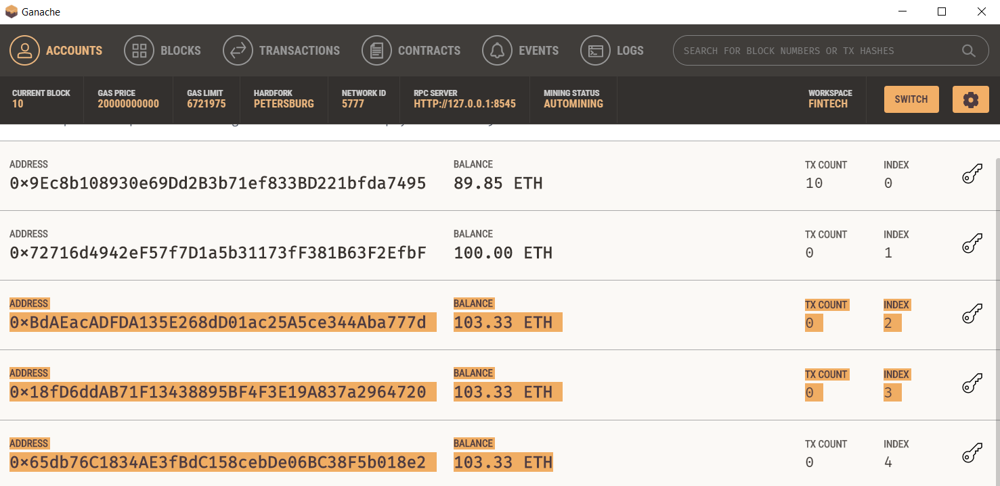
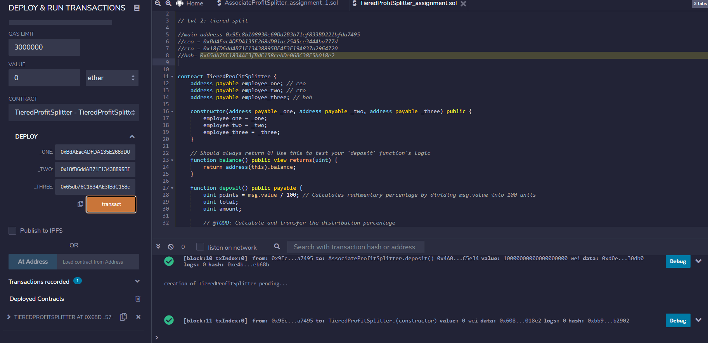
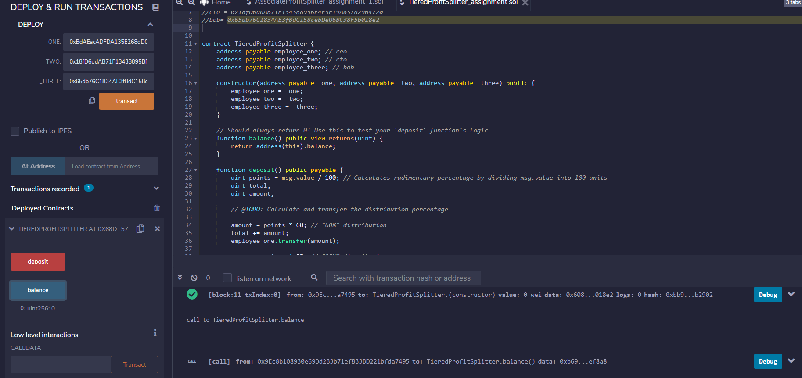
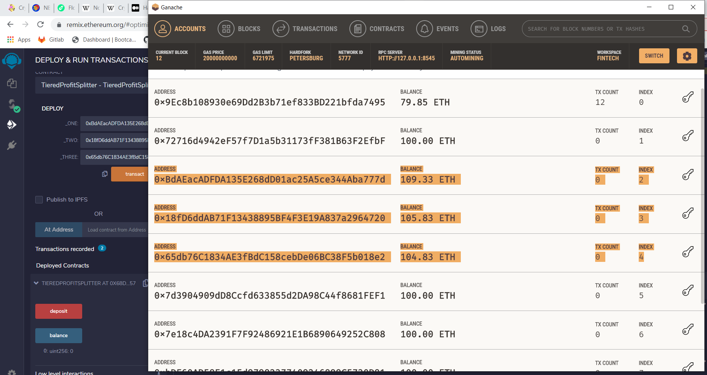

# Week20_Solidity Smart Contracts

## Background:

Your new startup has created its own Ethereum-compatible blockchain to help connect financial institutions, and the team wants to build smart contracts to automate some company finances to make everyone's lives easier, increase transparency, and to make accounting and auditing practically automatic! Fortunately, you've been learning how to program smart contracts with Solidity! What you will be doing this assignment is creating 3 ProfitSplitter contracts. These contracts will do several things:

Pay your Associate-level employees quickly and easily.

Distribute profits to different tiers of employees.

Distribute company shares for employees in a "deferred equity incentive plan" automatically.

## Instructions:

This assignment has three levels of difficulty, with each contract increasing in complexity and capability. Although it is highly recommended you complete all three contracts, you are only required to solve one of the three contracts. Recommended to start with Level 1, then move forward as you complete the challenges. You can build all three with the skills you already have!

Level One is an AssociateProfitSplitter contract. This will accept Ether into the contract and divide the Ether evenly among the associate level employees. This will allow the Human Resources department to pay employees quickly and efficiently.

Level Two is a TieredProfitSplitter that will distribute different percentages of incoming Ether to employees at different tiers/levels. For example, the CEO gets paid 60%, CTO 25%, and Bob gets 15%.

Level Three is a DeferredEquityPlan that models traditional company stock plans. This contract will automatically manage 1000 shares with an annual distribution of 250 over 4 years for a single employee.

These contracts are uploaded in the Remix Environment and connected to 'Injected Web3' Custom network.

Ganache is used to generate accounts with preloaded Ether. Select Hardfork: Petersburg, Network ID: 5777, RPC Server: http://127.0.0.1:8545.

MetaMask is connected to Localhost 8545 and accounts from Ganache are loaded into MetaMask.

## Level 1:

The AssociateProfitSplitter Contract will accept Ether into the contract and divide it amongst the associate level employees evenly. A constructor function is created to accept the three addresses. 

Main address = 0x9Ec8b108930e69Dd2B3b71ef833BD221bfda7495
Employee_one = 0xBdAEacADFDA135E268dD01ac25A5ce344Aba777d
Employee_two = 0x18fD6ddAB71F13438895BF4F3E19A837a2964720
Employee_three = 0x65db76C1834AE3fBdC158cebDe06BC38F5b018e2

When the contract is deployed, we need to make sure that it is deployed from the 'main account. In the Deploy section, enter the three employee addresses and hit transact.

Once the contract has been successfully deployed, under Deployed Contracts, click on the AssociateProfitSplitter drop down. Two buttons named deposit and balance should appear. The Balance button with show the contract start balance is 0.

Next, in the amount box, put 10 Ether and click deposit. The contract will run and transfer the money from the 'main account' evenly to the employers accounts.

In the other employers account, we can see the account balance has increased by 3.33 Eth.

## Level 2

In this contract, rather than splitting the profits between Associate-level employees, we will calculate rudimentary percentages for different tiers of employees (CEO, CTO, and Bob).

The current balances of the account are:

The first is the main account and other accounts are for the CEO, CTO and Bob.

The contract will be deployed from the main address. Once deployed, we will enter the three addresses and click Transact.

Once deployed, we will see a TieredProfitSplitter drop down with two buttons for Deposit and Balance. Check that the Balance is 0.

To run the contract, put 10 Ether in the Value box and press the Deposit Button. The amount should be transfered to the respective addresses as per the details in the contract.

As you can see, the initial balance of the accounts was 103.33 Eth where as now the accounts have been updated successfully.

